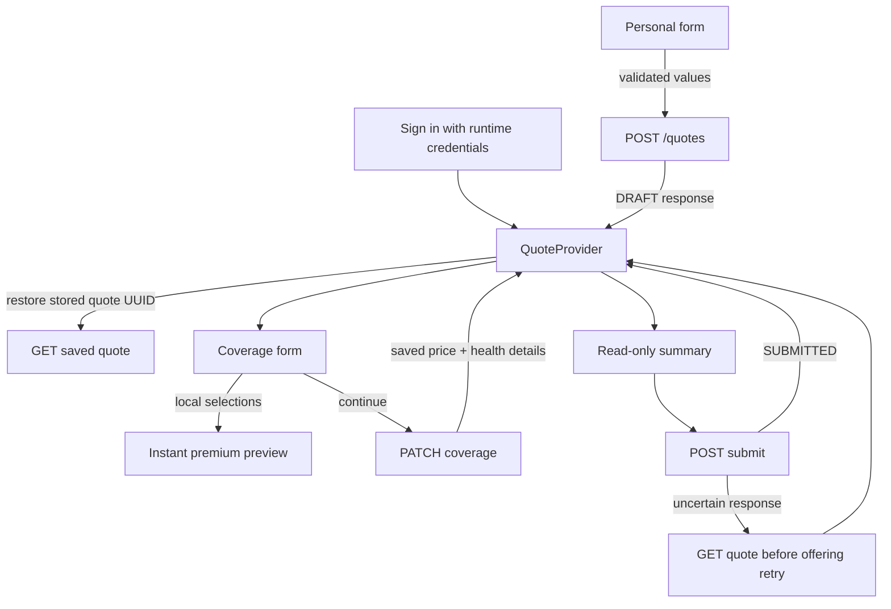

# Frontend walkthrough

Start with the [Java/Spring tour](https://github.com/5h1rU/clara-quotes-backend/blob/main/docs/WALKTHROUGH.md) for backend concepts. This guide connects the UI to that system.

## Read in this order

1. `src/types.ts`: personal details, health fields, statuses and saved quote. The API response permits null coverage because new drafts do not have it yet.
2. `src/api.ts`: all HTTP calls, credentials, request timeout and error translation. The browser knows nothing about JPA or Kafka.
3. `src/QuoteContext.tsx`: saved server response and operations used by every route.
4. `src/App.tsx`: layout, authentication gate, route table and progress indicator.
5. `src/pages/PersonalStep.tsx`: first form and draft creation.
6. `src/pages/CoverageStep.tsx`: conditional fields and draft update.
7. `src/pages/SummaryStep.tsx`: server-confirmed review and submission states.
8. `src/pricing.ts`: immediate preview of the server formula.

## Local input versus saved state

React Hook Form owns edits inside a form. Context owns the latest saved quote from the API. `useWatch` observes selections for a live premium. Clicking Continue validates the local form, awaits the HTTP call, replaces saved state, and navigates. Navigation happens after success, so a failed request does not pretend a step was completed.

The preview price and response price have different roles. The first is convenient feedback; the second is authoritative. Summary reads `quote.estimatedMonthlyPremium`, never a locally reconstructed price.

Going back from Summary to Coverage creates form defaults from saved data. Changing personal details creates a new quote because the specified API has no edit-personal endpoint. Existing unchanged values reuse the ID. The UI explains that older drafts expire.

Only the quote ID is persisted in sessionStorage. Health, identity and credentials are not stored there. Refresh clears React memory; sign-in uses the ID to reload the authenticated quote. Unsaved edits disappear on refresh by design. A new tab has its own session storage.

## Conditional validation

The boundary is `age > 65`, not `>= 65`. The server age determines whether the health section is rendered and whether Yup requires answers. A radio group's unselected state is `undefined`; No is `false`. This distinction prevents treating unanswered questions as No.

When conditions change to No, `setValue('conditions', [])` removes stale selections. For younger applicants, the outgoing object is explicitly `{ coverageType }` even if an old form value existed. The server independently checks the same rule.

## Errors and uncertainty

`ApiError` carries HTTP status, application code and field messages. Each form shows a general error and maps available field errors. A 401 offers sign-in again. A request has a 12-second browser timeout so a stalled service cannot leave a button spinning forever.

If submit fails, Context attempts `GET /quotes/{id}`. A 200 SUBMITTED here means the original request succeeded and its response was lost; the UI shows success. SUBMISSION_FAILED means retry is allowed. If even the reload fails, it preserves the original error and lets the user explicitly reload saved state. Duplicate successful submit is safe at the backend regardless of disabled buttons.

## Make and verify a change

For a label/field validation change: update the page or Yup schema and the relevant component test. For a pricing change in a hypothetical exercise: update both `pricing.ts` and Java, including their tests; never modify the assignment formula in the submitted version. For a new saved field: update TypeScript types, form/schema, API payload, Java DTO/entity/migration and summary together.

Run `npm test`, `npm run lint`, `npm run build`, then `npm run test:e2e` with the real backend running. The browser suite checks desktop and mobile, senior pricing, age boundaries, back navigation, reload/resume and authentication failures.
